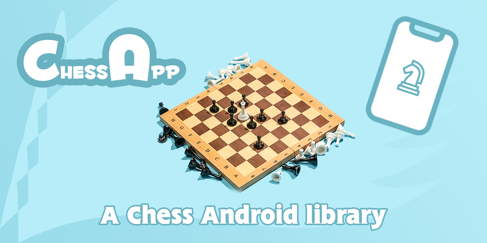
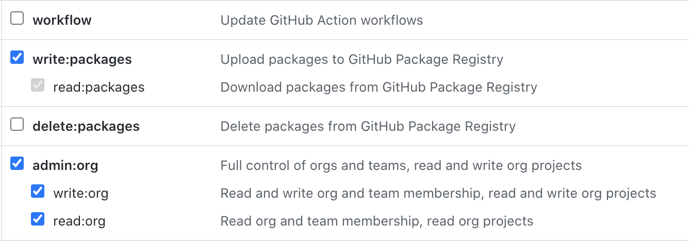

# ChessApp - An Android Chess Library!

This library contains the essential functionality of the Chess game, so you will be able to create your own interface using the logic from this SDK in a very simple way.

[](https://android-arsenal.com/api?level=14)



## General

This library offers you a wide variety of methods with which you can create your own game, the way of implementation is very simple and the use is much easier.

## Install

In order to use any library published within GitHub packages, you will need to do the following steps described [here](https://docs.github.com/es/github/authenticating-to-github/keeping-your-account-and-data-secure/creating-a-personal-access-token) to obtain your personal token.

You will have to create your token by requesting the following permissions:



Once your token is created (remember to save it and never share it) we will create the following files in your project:

1. Add the following code in your module where the SDK will be used:

```groovy
repositories {
    maven {
        name = "GitHubPackages"
        url = uri("https://maven.pkg.github.com/jassielcastro/ChessApp")
        credentials {
            username = YOUR_GITHUB_USER
            password = YOUR_GITHUB_TOKEN
        }
    }
}
```

2. Then add this dependency to your module where the SDK will be used:

```groovy
dependencies {
    implementation 'com.ajcm.chess:core:$current-version'
}
```

# Usage

All we need to do is to create a Board, yes, that's all.

And the board is created as follows:

```kotlin
var board: Board = Board()
```

Now, what can we do with our game? It's very simple, we just need to observe states of the game itself.

Observe the Status of the players: Moving, Waiting:

```kotlin
val whitePlayerStatus: StateFlow<PlayerStatus>
    get() = board.whitePlayerStatus
val blackPlayerStatus: StateFlow<PlayerStatus>
    get() = board.blackPlayerStatus
```

Observe the Status of the Kings: None, Check, CheckMate:

```kotlin
val whiteKingStatus: StateFlow<KingStatus>
    get() = board.whiteKingStatus
val blackKingStatus: StateFlow<KingStatus>
    get() = board.blackKingStatus
```

Observe the available pieces on board:

```kotlin
val whiteAvailablePieces: StateFlow<List<Piece>>
    get() = board.whiteAvailablePieces
val blackAvailablePieces: StateFlow<List<Piece>>
    get() = board.blackAvailablePieces
```

Observe the "dead" pieces on board:

```kotlin
val whiteDeadPieces: StateFlow<List<Piece>>
    get() = board.whiteDeadPieces
val blackDeadPieces: StateFlow<List<Piece>>
    get() = board.blackDeadPieces
```

Observe the Pawn status (if it is available to transforme to another piece):

```kotlin
val pawnToEvolve: StateFlow<Pawn?>
    get() = board.pawnToEvolve
```

Once we have all these objects, we can work with them.

Get all posible moves of a piece:

* **Note**: This list of moves is given by valid moves that do not jeopardize the King's status, i.e., if the King is in Check status, the returned moves of a piece will be the only ones that avoid the Check to its King, otherwise it will be an empty list.

```kotlin
piece.getAllPossibleMoves()
```

Evolve a Pawn piece when it´s possible:

```kotlin
board.transform(pawn, transformTransformation) // PawnTransform.[BISHOP, KNIGHT, QUEEN, ROOK]
```

Validate if a piece can move:
```kotlin
piece.playerIsMoving()
```

Move a piece:

* **Note**: If an enemy piece is encountered in such a move, it is eliminated and a notification is notified to dead pieces observer.

```kotlin
piece.updatePosition(newPosition)
```

# Contributing & Reporting Issues

[Please read this if you're reporting an issue, or thinking of contributing!](./CONTRIBUTING.md)

## Licence

See the [LICENSE](LICENSE.md) file for license rights and limitations (MIT).

Copyright 2021 AJCM.
